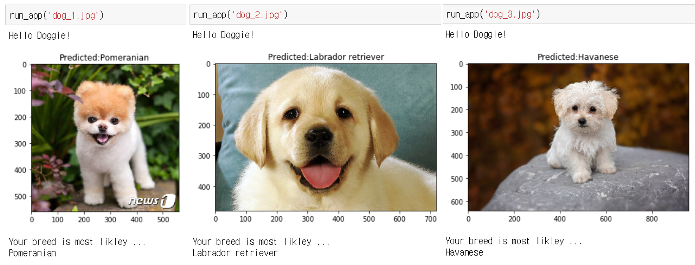
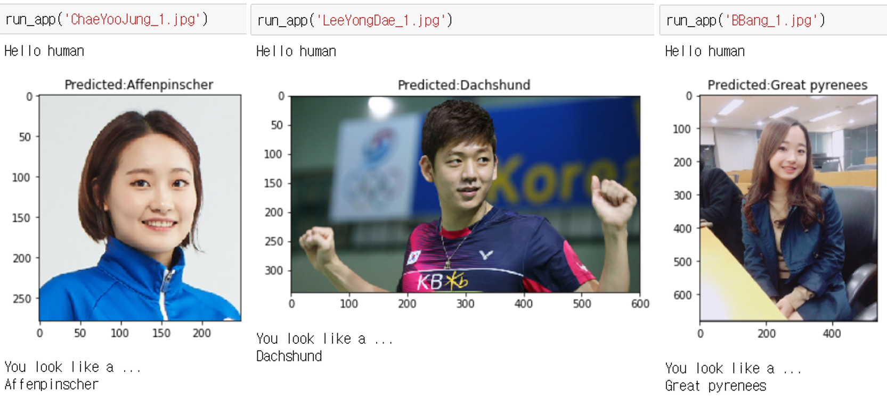

# DEEP LEARNING NANODEGREE
# Project2. Dog Breed Classifier

## 1. Abstract

The purpose of this project is to make aplication program that can classify dog breed

If detected picture is dog, program should present the dog's breed

And if detected picture is human, program should present the most similar dog's breed

First, I made human detection program

To do that, I used cv2.CascadeClassifier in cv2 libarary

Secondly, I made dog detection program

To do that, I used transfer learning of VGG16 and used all the parameters already trained

Thirdly, I made classifying dog's breed program

To do that, I created CNN model by scratch first

But simple CNN structure that made by scratch did not work well

So I also used transfer learning by VGG16 but changed last classifier linear model to 133 final classes

(Its because ImageNet data have 133 sorts of dogs)

Finally I put these all together to make application program


## 2. Related Study


#### 1) Convolutional Neural Network

① MLP vs CNN

② MNIST dataset

③ Loss & Optimization

④ About CNN : Filters, Stride, Padding, Pooling

⑤ Image augmentation

⑥ Visualizing CNN

#### 2) Transfer Learning

① Various architectures can be used to transfer learning

② Fine tuning according to size of data and similarity

#### 3) Weight Initialization

① Normal distribution weight initialization

#### 4) Autoencoder

① Encoder & Decoder

② Denoiser using autoencoder


## 3. Details

#### 1) Human Detection Program

```python
face_cascade = cv2.CascadeClassifier('haarcascades/haarcascade_frontalface_alt.xml')

def face_detector(img_path):
    img = cv2.imread(img_path)
    gray = cv2.cvtColor(img, cv2.COLOR_BGR2GRAY)
    faces = face_cascade.detectMultiScale(gray)
    return len(faces) > 0   
```

I tested this function to 100 images of human and dogs

The number detected human face at 100 pictures :  98

The number detected dog face at 100 pictures :  17


#### 2) Dog Detection Program Using Transfer Learning

ImageNet have dogs data indices between 151~268

Therefore if result of VGG16_predict(image) is between them, it is dog

```python
VGG16 = models.vgg16(pretrained=True)

use_cuda = torch.cuda.is_available()

if use_cuda:
    VGG16 = VGG16.cuda()
```
```python
def VGG16_predict(img_path):
    
    image = Image.open(img_path).convert('RGB')

    transformations = transforms.Compose([transforms.Resize(size=224),
                                          transforms.CenterCrop((224,224)),
                                         transforms.ToTensor(),
                                         transforms.Normalize(mean=[0.485, 0.456, 0.406],
                                                              std=[0.229, 0.224, 0.225])])
    image_tensor = transformations(image)[:,:,:].unsqueeze(0)
    
    if torch.cuda.is_available():
        image_tensor = image_tensor.cuda()

    output = VGG16(image_tensor)
    
    _, preds_tensor = torch.max(output, 1)
    pred = np.squeeze(preds_tensor.numpy()) if not use_cuda 
                                            else np.squeeze(preds_tensor.cpu().numpy())
 
    return int(pred)
```
```python
def dog_detector(img_path):
    
    output = VGG16_predict(img_path)
    
    if (150 < output) and (output < 269):
        result = True
    else:
        result = False
    
    return result
```

#### 3) Classifying Dog's Breed Program

① Data preprocessing and loading 

I manipulated training data by flipping, rotating to prevent overfitting

And just resize and crop, normalize valid & test data

```python
train_data_dir = '/data/dog_images/train'
valid_data_dir = '/data/dog_images/valid'
test_data_dir = '/data/dog_images/test'

train_transforms = transforms.Compose([transforms.Resize(size=224),
                                       transforms.CenterCrop((224,224)),
                                       transforms.RandomHorizontalFlip(),
                                       transforms.RandomRotation(10),
                                       transforms.ToTensor(),
                                       transforms.Normalize(mean=[0.485, 0.456, 0.406], 
                                                            std=[0.229, 0.224, 0.225])])

valid_transforms = transforms.Compose([transforms.Resize(224),
                                       transforms.CenterCrop((224,224)),
                                       transforms.ToTensor(),
                                       transforms.Normalize(mean=[0.485, 0.456, 0.406], 
                                                            std=[0.229, 0.224, 0.225])])

test_transforms = transforms.Compose([transforms.Resize(224),
                                      transforms.CenterCrop((224,224)),
                                      transforms.ToTensor(),
                                      transforms.Normalize(mean=[0.485, 0.456, 0.406], 
                                                           std=[0.229, 0.224, 0.225])])

image_datasets = {'train': datasets.ImageFolder(train_data_dir, transform=train_transforms),
                  'valid': datasets.ImageFolder(valid_data_dir, transform=valid_transforms),
                  'test': datasets.ImageFolder(test_data_dir, transform=test_transforms)
                 }

loaders_scratch = {
    x: torch.utils.data.DataLoader(image_datasets[x], shuffle=True, batch_size=32)
    for x in ['train', 'valid', 'test']}

```

② Create my own architecture

```python

class Net(nn.Module):

    def __init__(self):
        super(Net, self).__init__()
        
        self.conv1 = nn.Sequential(
                    nn.Conv2d(3, 16, kernel_size=3, stride=1, padding=1),
                    nn.BatchNorm2d(16)
                    )

        self.conv2 = nn.Sequential(
                    nn.Conv2d(16, 32, kernel_size=3, stride=1, padding=1),
                    nn.BatchNorm2d(32)
                    )
        
        self.conv3 = nn.Sequential(
                    nn.Conv2d(32, 64, kernel_size=3, stride=1, padding=1),
                    nn.BatchNorm2d(64)
                    )        

        self.pool = nn.MaxPool2d(2, 2)

        self.fc1 = nn.Linear(64 * 28 * 28, 500)

        self.fc2 = nn.Linear(500, 133)

        self.dropout = nn.Dropout(0.25)
        
        self.batch_norm = nn.BatchNorm1d(num_features=500)
    
    def forward(self, x):

        x = self.pool(F.relu(self.conv1(x)))
        
        x = self.dropout(x)
        
        x = self.pool(F.relu(self.conv2(x)))
        
        x = self.dropout(x)
        
        x = self.pool(F.relu(self.conv3(x)))

        x = self.dropout(x)
             
        x = x.view(x.size(0), -1)
        
        x = F.relu(self.batch_norm(self.fc1(x)))
        
        x = self.dropout(x)
        
        x = self.fc2(x)
        
        return x
        
criterion_scratch = nn.CrossEntropyLoss()

optimizer_scratch = optim.SGD(model_scratch.parameters(), lr = 0.05)
```

After 10 epochs, I achieved

train loss : 4.639 → 3.091

valid loss : 4.599 → 4.108

test loss : 3.981 (11% accuracy)

※ Rubic point for this is just better than 10% accuracy


③ Use transfer learning

I used VGG16 model

```python

model_transfer = models.vgg16(pretrained=True)

if use_cuda:
    model_transfer = model_transfer.cuda()

for param in model_transfer.parameters():
    param.requires_grad = False
    
model_transfer.classifier[6] = nn.Linear(4096,133)

criterion_transfer = nn.CrossEntropyLoss()
optimizer_transfer = optim.Adam(model_transfer.classifier[6].parameters(), lr=0.001)

```

After 10 epochs, achieved

train loss : 1.262 → 0.304
valid loss : 0.561 → 0.446

test loss : 0.628 (85% accuracy)


```python

def predict_breed_transfer(img_path):
    
    image = Image.open(img_path).convert('RGB')
    transformations = transforms.Compose([transforms.Resize(size=224),
                                          transforms.CenterCrop((224,224)),
                                         transforms.ToTensor(),
                                         transforms.Normalize(mean=[0.485, 0.456, 0.406],
                                                              std=[0.229, 0.224, 0.225])])
    image_tensor = transformations(image)[:,:,:].unsqueeze(0)
    
    if use_cuda:
        image_tensor = image_tensor.cuda()
    
    output = model_transfer(image_tensor)

    preds_tensor = torch.argmax(output, 1)
    pred = np.squeeze(preds_tensor.numpy()) if not use_cuda 
                                            else np.squeeze(preds_tensor.cpu().numpy())
    
    return class_names[pred]
```

#### 4) Put these all together

```python

def display_image(img_path, title="Title"):
    image = Image.open(img_path)
    plt.title(title)
    plt.imshow(image)
    plt.show()
    
def run_app(img_path):
    ## handle cases for a human face, dog, and neither
    if dog_detector(img_path):
        print("Hello Doggie!")
        predicted_breed = predict_breed_transfer(img_path)
        display_image(img_path, title=f"Predicted:{predicted_breed}")
        
        print("Your breed is most likley ...")
        print(predicted_breed)
    elif (face_detector(img_path)):
        print("Hello human")
        predicted_breed = predict_breed_transfer(img_path)
        display_image(img_path, title=f"Predicted:{predicted_breed}")
        
        print("You look like a ...")
        print(predicted_breed)
    else:
        print("There are no human or dog")
        display_image(img_path, title="Not a human or dog")
    print("\n")

```


## 4.Results





## 5.Discussion

#### 1) Data augmentation

Refer to AlexNet, VGG, ResNet.. I can get so many methods to augmentation
And it will give more anti overfitting result and higher accuracy

#### 2) Changing architecture

This time, I only changed last fully connected layer so as not to spend too much time on training
But if I change all the classifier layers and train all the parameters again,
I will get better result

#### 3) Human detection part

It's accuracy at human picture was good, but it also mistaken dog as human as 17%
So it also need to use data learning method not only depend on cv2 library


